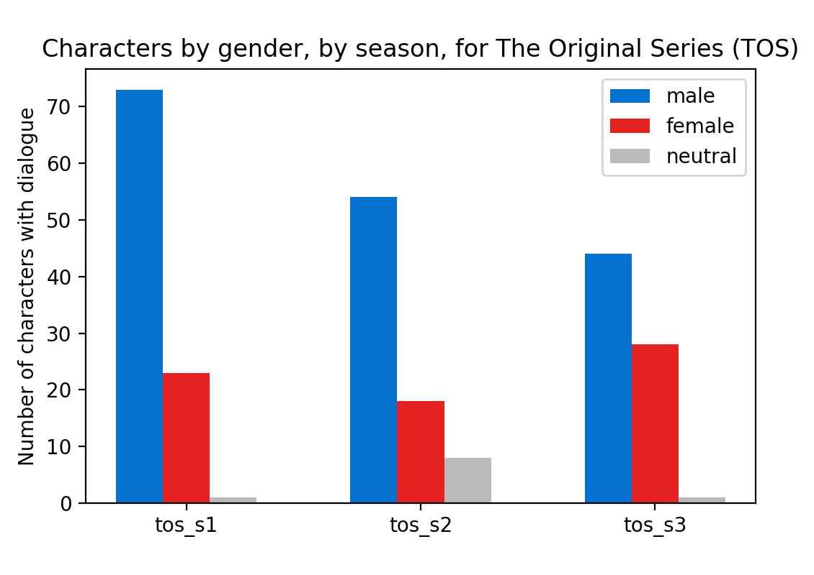
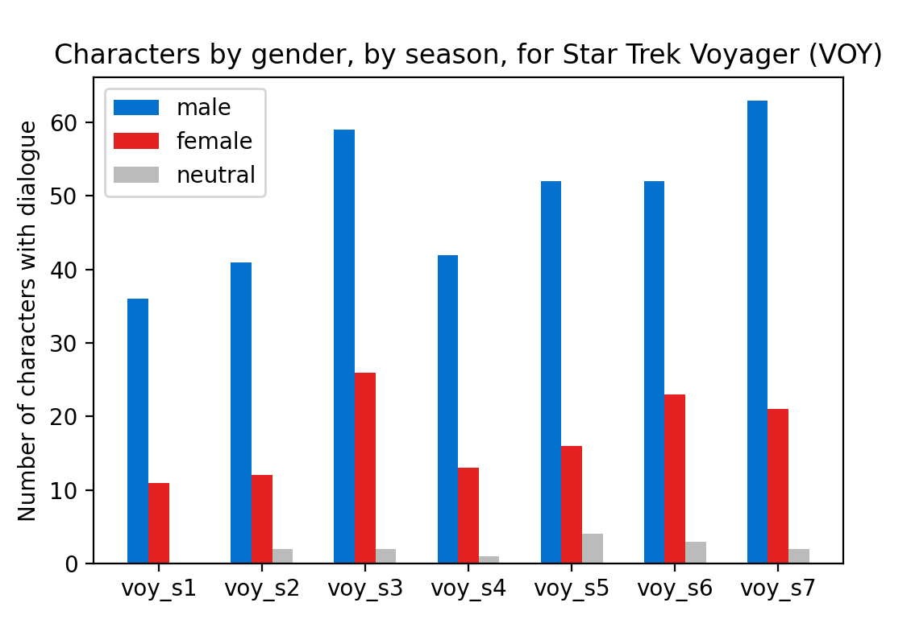
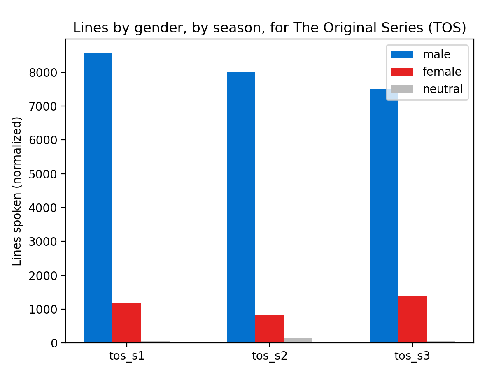

# Gender in „Star Trek“ dialogue and characters 
<a id="title"></a>
**A statistical analysis of episode transcripts, by Dr. Birko-Katarina Ruzicka**

<br>

<br>

## Motivation

It is no secret that dialogue in movies and series has been unevenly distributed between genders this far ([Source 1](#bibliography)), although surprisingly few studies have been conducted on the matter so far, and even fewer were published in peer-reviewed journals. Rare and beautiful examples for what could be done include 
* the outstanding work by Anderson and Daniels titled "Film Dialogue from 2,000 screenplays, Broken Down by Gender and Age" ([Source 1](#bibliography)), and 
* T. Bowe's "Stargate SG1 Dialogue Text Analysis" ([Source 2](#bibliography)), in which he thoroughly analyses dialogue by character, speech content, and positive vs. negative sentiment across five seasons of a sci-fi show. 

(both of which, by the way, are filled to the brim with beautiful Data Vizualisation graphics!)

As a lifelong "trekkie", I was curious as to how this was handled within the **Star Trek** franchise, a notoriously socially progressive format whose plotlines are frequently driven by themes of morality, tolerance, and equality. Star Trek's numerous shows and movies, covering roughly 60 years of social development, also make it an ideal target for studies across time. 

I analysed the transcripts of most Star Trek series for the ratio of male, female, and gender-neutral characters with speaking roles, as well as how many lines of dialogue are spoken by each gender. In particular, I focused on how this distribution changed over time. 

These are the series I included in the study:

|title                               | abbreviation |&emsp; originally aired|
:------------------------------------| ------------ | ---------------------:|
|Star Trek: The Original Series      |TOS           |              1966-1969|
|Star Trek: The Animated Series&emsp;|TAS           |              1973-1974|
|Star Trek: The Next Generation      |TNG           |              1987-1994|
|Star Trek: Deep Space Nine          |DS9           |              1993-1999|
|Star Trek: Voyager                  |VOY           |              1995-2001|
|Star Trek: Enterprise               |ENT           |              2001-2005|
|Star Trek: Discovery                |DIS           |              2017-2021|
|Star Trek: Picard                   |PIC           |              2020-2020|

<br>

The main steps in this analysis were:

1. collecting and preparing the data ([go there](#part1))
2. bringing in additional, manually prepared metadata ([go there](#part2))
3. analysis of gender in individual series ([go there](#part3))
4. analysis of gender across all series with time ([go there](#part4))

<br>

## 1. Collecting and preparing the data 
<a id="part1"></a>

I initially was inspired by, and worked from, a dataset of "Star Trek Scripts" from Kaggle ([Source 3](#Bibliography)). While working with this data, however, I noticed some issues that required extensive cleaning, and some issues that I was unable to correct at all. Furthermore, having been created several years ago, the dataset did not include the most recent Star Trek series "Discovery" and "Picard" (which, spoiler!, have turned out to be pivotal to my analysis).

So, in a fit of perfectionism, I wrote my own Python webscraping algorithm to fetch the transcripts to transform the text into a clean, ready-to-use dataset in JSON format. The JSON file and the algorithm are available [in this GitHub repository](https://github.com/BirkoRuzicka/Star-Trek-Transcripts).

(***A note on code in this notebook:***
*the examples of code I show here are not intended to represent a fully working model of my analysis, but rather to illustrate concepts. The full code is available on GitHub, please use this if you intend to recreate any of my work!*)


To begin the analysis, the contents of the JSON file are read into a Pandas dataframe. To prevent the code from being unnecessarily complex, I did this series-by-series. I will now show the code for creating the "TOS" segment of the dataframe:

```python
import json
import pandas as pd

# open the JSON and read each series' entry into a variable
with open('StarTrekDialogue.json', 'r') as read_file:
    all_series = json.load(read_file)
del(read_file)
    
tos = all_series['TOS']  # ...and so on, for tas, tng, ds9, ...

# transform dict -> series -> dataframe
tos_series = pd.concat({k: pd.Series(v) for k, v in tos.items()})
tos_df = pd.Series.to_frame(tos_series).reset_index()
tos_df.columns = ['Episode', 'Character', 'Lines']
```

<br>
The dataframe now contains every line ever spoken on "TOS", so in the next step I removed all entries for 'minor characters' who have less than 10 lines of dialogue per episode. This reduces noise and lowers the overall workload in the next step.
<br>
<br>

```python
# create additional column in the dataframe to show a character's linecount per episode
tos_df['Linecount'] = tos_df['Lines'].str.len()

# drop entries where Linecount is less than 10
for index in tos_df.index:
    if tos_df.at[index, 'Linecount'] < 10:
        tos_df.drop(index, axis=0, inplace=True)
```
<br>

## 2. Additional metadata
<a id="part2"></a>

In addition to the information on episode number, character name, and lines spoken by the character, I needed the following additional metadata for the episodes and characters:

* **season** of the episode within the series
* **year** when the episode was first aired on U.S. tv (and for DIS and PIC, on streaming services)
* **episode title** for personal orientation within the series
* **character gender**

The first three items were easily extracted from Wikipedia (and saved in a CSV file for later use), but the characters' gender had to be assessed manually. Working from a list of unique character names of the series (`tos_df['Character'].unique()`), I cross-referenced the fandom encyclopedia [Memory Alpha](https://memory-alpha.fandom.com/), my memory, and in some inconclusive cases even the episode's video itself, to compile a CSV file of the gender(\*) for each character with at least 10 lines in the respective episode. 

To illustrate the scale of this endeavour:

|series          |TOS|TAS|TNG|DS9|VOY|ENT|DIS|PIC|
|---             |---|---|---|---|---|---|---|---|
|character count |229| 49|419|362|385|211| 74| 33|

<br>

___

***\* A note on "gender" in this study***

*Rarely in Star Trek is a character's gender explicitly stated on screen, except for episodes that expressly deal with gender. Notable examples of such episodes include "The Outcast" (TNG, season 5, episode 17), "Cogenitor" (ENT, season 2, episode 22), and Adira Tal's plotline (DIS, season 3). Much could and should be said about gender expression in Star Trek, but that is not the scope of this project. If anyone reading this feels the calling to expand on the topic, I fiercely encourage you to get in touch with me!*

*For the purpose of this study, I assigned characters the gender which they were expressing to the viewer. In almost every case, I found the characters' gender expression to be stereotypical, sometimes to an amusing degree. However, in the few ambiguous cases I relied on how the character referred to themselves or was referred to by another in dialogue, as well as background knowledge on the character. For example:*

*- the ship's computer generally speaks in a female-coded voice (fellow trekkies will know that it was indeed the voice of Majel Barret, the wife of Gene Roddenberry himself). However, the computer never expresses gender, nor is it ever addressed as anything other than "it", so I classified it as genderneutral*

*- the Voyager's "Emergency Medical Hologram" is a non-corporeal computer program, so it is not "alive" and does not have a gender in the conventional sense. But it is generally referred to as "he", the crew members treat it as a person, and we come to understand throughout the plot that it is evolving self-awareness as a male person. I therefore classified this character as male*

*- Next Generation's "Data" is an android, whose outward gender expression is distinctly male. Furthermore, Data is consistently portrayed as self-aware and is shown to understand himself as male, so I classified him as male*
___

<br>

Once I had compiled both files of additional data, I added them to the dataframe and re-ordered the columns:

```python
# open csv files
tos_data = pd.read_csv('additional_data/tos_data.csv', index_col=0, delimiter=';')
tos_gender = pd.read_csv('additional_data/tos_gender.csv',
                                 header=None, index_col=0, squeeze=True, delimiter=';').to_dict()

# the season-year-episodetitle data can simply be merged to the df,
# as it's in the same format (one entry per episode)
tos_df = tos_df.merge(tos_data, left_on='Episode', right_index=True)
        
# the gender data has to be mapped to the dataframe, as characters appear in multiple episodes  
tos_df['Gender'] = tos_df['Character'].map(tos_gender)
        
# re-order columns
tos_df = tos_df[['Episode', 'Season', 'Year', 'Title', 'Character', 'Gender', 'Lines', 'Linecount']]
```

<br>

## 3. Analysis of individual series
<a id="part3"></a>

First, I looked at the gender ratio of the individual series, both in total as well as broken down by season.

### Characters per gender, whole series

I began by counting the unique characters per gender for each series. The following code runs through the series' dataframe row by row, sorting the row's field for "Character" into a dictionary depending on the row's field for "Gender". Then I counted the unique entries in each list, because the main cast and several recurring characters appear in multiple episodes.

(Note: there are other ways to achieve the same goal, e.g. using `df.groupby(['Gender'])`, but my brain found this approach the easiest to follow)

```python
dataframe = tos_df
characters_gender = {'m': [], 'f': [], 'n': []}

for i in dataframe.index:
    if dataframe['Gender'][i] == 'm':
        char_gender['m'].append(dataframe['Character'][i])
    elif dataframe['Gender'][i] == 'f':
        char_gender['f'].append(dataframe['Character'][i])
    elif dataframe['Gender'][i] == 'n':
        char_gender['n'].append(dataframe['Character'][i])

char_m = len(np.unique(char_gender['m']))
char_f = len(np.unique(char_gender['f']))
char_n = len(np.unique(char_gender['n']))
```

<br>
I visualized the results in a pie chart:
<br><br>

```python
plt.pie([char_m, char_f, char_n],
        labels=['male', 'female', 'genderneutral'],
        shadow=False,
        startangle=90,
        autopct='%1.0f%%',
        colors=['#0471CE', '#E52222', '#BBBBBB'])
```

<br>
Some results:
<br><br>

 &emsp;&emsp;&emsp;&emsp; 
        

<br>

...wait. So the ratio of female characters is actually **lower** in VOY, a show with a female captain, aired 30 years after TOS? That does not look like progress yet.
<br><br>

### Lines by gender, whole series

Let's see how much characters of each gender get to say in each show though. For this I once again run through the dataframe row by row, and add the field for "Linecount" to a dictionary depending on the row's field "Gender":<br>

```python
lines_by_gender = defaultdict(np.int64)
for i in dataframe.index:
    lines_by_gender[dataframe['Gender'][i]] += dataframe['Linecount'][i]   
        
# pie chart
plt.pie([lines_by_gender['m'], lines_by_gender['f'], lines_by_gender['n']],
        labels=['male', 'female', 'genderneutral'],
        shadow=False, 
        startangle=90,
        autopct='%1.0f%%',
        colors=['#0471CE', '#E52222', '#BBBBBB'])
```

<br>
The resulting pie charts:
<br><br>

 &emsp;&emsp;&emsp;&emsp; 
        

<br>
Okay, some improvement there.
<br>

### Most loquacious characters
<br>

<table>
<tr><th>TOS</th><th>VOY</th></tr>
<tr><td>

|character|lines overall|gender|
|:---     |         ---:|  ---:|
|KIRK     |  9074       |    m |
|SPOCK    |  4580       |    m |
|MCCOY    |  2552       |    m |
|SCOTT    |  1378       |    m |
|SULU     |   785       |    m |
|UHURA    |   751       | **f**|
|CHEKOV   |   474       |    m |
|PIKE     |   222       |    m |
|CHAPEL   |   194       | **f**|
|MUDD     |   150       |    m |

</td><td>

|character|lines overall|gender|
|:---     |         ---:|  ---:|
|JANEWAY  | 11717       | **f**|
|EMH      |  5713       |    m |
|CHAKOTAY |  5702       |    m |
|PARIS    |  5110       |    m |
|TUVOK    |  4681       |    m |
|KIM      |  4489       |    m |
|TORRES   |  4483       | **f**|
|SEVEN    |  4143       | **f**|
|NEELIX   |  3297       |    m |
|KES      |  1273       | **f**|

</td></tr> </table>

    
<br>
From this we see that in the their respective "Top 10 Characters", VOY has twice as many speaking characters as TOS, and they have a lot more to say too. I would therefore conclude that in VOY, more of the minor characters with speaking roles are male, than in TOS.
<br><br>

### Characters and lines by gender, by season

The gender ratio per season is found similarly to the method shown above, except that an additional outer for-loop is needed to run through the series' dataframe several times, season by season.

To find the gender ratio for characters:
<br>

```python
dataframe = tos_df

seasons = list(dataframe['Season'].unique())
char_gender_seasons = np.empty(len(seasons), dtype=dict)
male, female, neutral = [], [], []

for seasonnumber, season in enumerate(seasons):
    char_gender = {'m': [], 'f': [], 'n': []}
    for i in dataframe.index:
        if dataframe['Season'][i] == season:
            if dataframe['Gender'][i] == 'm':
                char_gender['m'].append(dataframe['Character'][i])
            elif dataframe['Gender'][i] == 'f':
                char_gender['f'].append(dataframe['Character'][i])
            elif dataframe['Gender'][i] == 'n':
                char_gender['n'].append(dataframe['Character'][i])
    char_gender_seasons[seasonnumber] = char_gender
    male.append(len(np.unique(char_gender['m'])))
    female.append(len(np.unique(char_gender['f'])))
    neutral.append(len(np.unique(char_gender['n'])))
```

<br>
To visualize the result as a bar chart:
<br><br>

```python
series = 'The Original Series (TOS)'

fig, ax = plt.subplots()
x  = np.arange(len(seasons))
ax.bar(x - 0.2, male, 0.2, label='male', color='#0471CE')
ax.bar(x + 0, female, 0.2, label='female', color='#E52222')
ax.bar(x + 0.2, neutral, 0.2, label='neutral', color='#BBBBBB')
ax.set_ylabel('Number of characters with dialogue')
ax.set_xticks(x)
ax.set_xticklabels(seasons)
ax.legend()
ax.set_title(f'Characters by gender, by season, for {series}')
plt.show()
```

<br>

 &emsp;

        

<br>
The method for finding the gender ratio for lines is analogous and results in this:
<br><br>

 &emsp;

        

<br>

## 4. Analysis of gender across all series with time
<a id="part4"></a>

Finally, the most exciting part: A time series of gender^ ratios for all series of the Star Trek canon. (Please note: In the following steps I focussed on male and female characters and left out the genderneutral ones, mainly because they are regrettably low in number. I did this in an effort to produce plots that are simpler to understand, with no intention to be dismissive of any gender)

To tackle this, I first concatenated all series' dataframes into one massive dataframe `st_df`, in which each row represents one episode (760 episodes total). For each episode, I summed up the characters and linecounts based on gender.

Then I added additional columns, which are computationally derived from the existing ones:
* `Char_total` (sum of all characters with speaking roles for the episode)
* `Char_m_rel`, `Char_f_rel` (ratio of male and female characters, relative to Char_total)
<br>and, analogous to characters:
* `Lines_total`
* `Lines_m_rel`, `Lines_f_rel`

<br>

```python
# plot gender-ratio of characters, for each episode
fig, ax = plt.subplots()
ax.plot(st_df['Airdate'], chars_m_rel, alpha=0.2, c='#0471CE')        # male data - blue
ax.plot(st_df['Airdate'], st_df['Char_m_rel'], 'h', markersize=1.6,
        label='male', c='#0471CE')
ax.plot(st_df['Airdate'], chars_f_rel, alpha=0.2, c='#E52222')        # female data - red
ax.plot(st_df['Airdate'], st_df['Char_f_rel'], 'h', markersize=1.6,
        label='female', c='#E52222')
ax.legend(loc=1)
ax.set_xlabel("Year of episode's original air date (US)")
ax.set_ylabel('% of characters per episode')
ax.set_title('Development of characters per gender (%) with time')
ax.set_ylim([-0.12, max(st_df['Char_m_rel']) + 0.12])
plt.annotate('TOS', xy=(1967, -0.09))
plt.annotate('TAS', xy=(1973, -0.09))
plt.annotate('TNG', xy=(1990, -0.09))
plt.annotate('DS9', xy=(1994, -0.09))
plt.annotate('VOY', xy=(1998, -0.09))
plt.annotate('ENT', xy=(2003, -0.09))
plt.annotate('DIS', xy=(2016, -0.09))
plt.annotate('PIC', xy=(2020, -0.09))
plt.show()
```
<br>
The result:
<br><br>


        

<br>
Here we see that the ratio of male and female characters converge over time, and it appears that in the two youngest shows, gender parity in characters was achieved. This trend is even more distinct in lines per gender, shown below with trendlines for emphasis.
<br>


        
<br><br>

The [title image](#title) is a prettier visualization of the same data, achieved through gaussian line-smoothing and some plot styling in Matplotlib:
<br>

```python
# smoothed data
M = np.array(st_df['Lines_m_rel'])
F = np.array(st_df['Lines_f_rel'])
M_smooth = gaussian_filter1d(M, sigma=3.5)
F_smooth = gaussian_filter1d(F, sigma=3.5)

fig, ax = plt.subplots(figsize=(8, 5))

# glow effect
for n in range(1, 10):
    ax.plot(st_df['Airdate'], M_smooth,
            linewidth=2 + n, alpha=0.03, color='#0477D9')
    ax.plot(st_df['Airdate'], F_smooth,
            linewidth=2 + n, alpha=0.03, color='#EB2323')

ax.plot(st_df['Airdate'], M_smooth, c='#0471CE')
ax.plot(st_df['Airdate'], F_smooth, c='#E52222')

# axis properties
ax.set_title('LINES PER GENDER IN STAR TREK SERIES',
             font='Federation', size=24, color='#FEB54C')
ax.set_xlabel("episode's original air date (US)")
ax.set_ylabel('')
ax.set_ylim([-0.12, max(st_df['Lines_m_rel']) + 0.12])
ax.set_yticks([0.0, 0.2, 0.4, 0.6, 0.8, 1.0])
ax.set_yticklabels(['0 %', '20 %', '40 %', '60 %', '80 %', '100 %'])

# text labels
plt.annotate('male', xy=(1978, 0.89), color='#0471CE', size=14)
plt.annotate('female', xy=(1977, 0.06), color='#E52222', size=14)
plt.annotate('TOS', xy=(1967, -0.09), color='#FEB54C')
plt.annotate('TAS', xy=(1973, -0.09), color='#FEB54C')
plt.annotate('TNG', xy=(1990, -0.09), color='#FEB54C')
plt.annotate('DS9', xy=(1994, -0.09), color='#FEB54C')
plt.annotate('VOY', xy=(1998, -0.09), color='#FEB54C')
plt.annotate('ENT', xy=(2003, -0.09), color='#FEB54C')
plt.annotate('DIS', xy=(2016, -0.09), color='#FEB54C')
plt.annotate('PIC', xy=(2020, -0.09), color='#FEB54C')

# plot styling:
plt.style.use('dark_background')

for param in ['text.color', 'axes.labelcolor', 'xtick.color', 'ytick.color']:
    plt.rcParams[param] = '0.8'  # adjust text color

for param in ['figure.facecolor', 'axes.facecolor']:
    plt.rcParams[param] = '#080A0D'  # adjust background color

plt.rcParams['font.family'] = 'Verdana'  # adjust font
plt.rcParams['font.size'] = 11  # adjust font size

plt.show()
```

<br><br>
Credit for plot styling components:
<br>

**Font:** ['Federation classic' free font](https://www.dafont.com/federation-classic.font)

**Glow effect:** [Cyberpunk Style with Matplotlib](https://towardsdatascience.com/cyberpunk-style-with-matplotlib-f47404c9d4c5)

<br><br>
___

## Bibliography
<a id="bibliography"></a>

[1] 	H. Anderson und M. Daniels, „Film Dialogue from 2,000 screenplays, Broken Down by Gender and Age,“ 2016, https://pudding.cool/2017/03/film-dialogue/.
<br><br>
[2] 	T. Bowe, „Stargate SG1 Dialogue Text Analysis,“ 2021, https://www.kaggle.com/tombowe/stargate-sg1-dialogue-text-analysis.
<br><br>
[3] 	G. Broughton, „Kaggle - Star Trek Scripts,“ 2018, https://www.kaggle.com/gjbroughton/start-trek-scripts.
